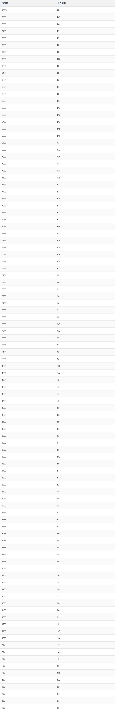
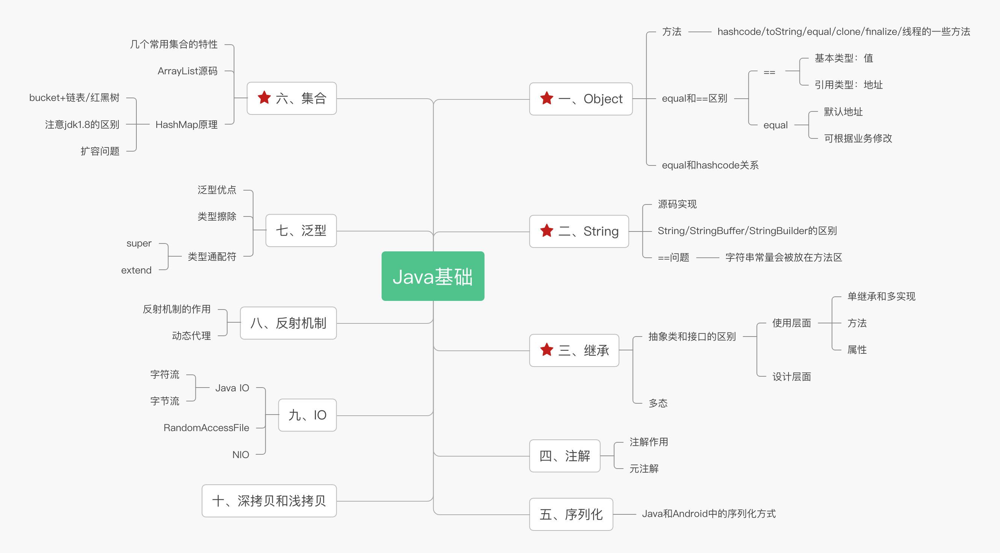
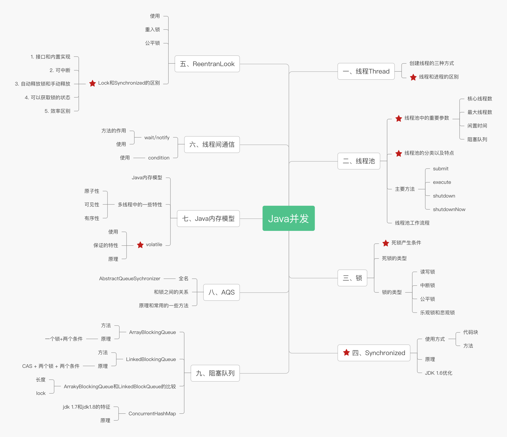
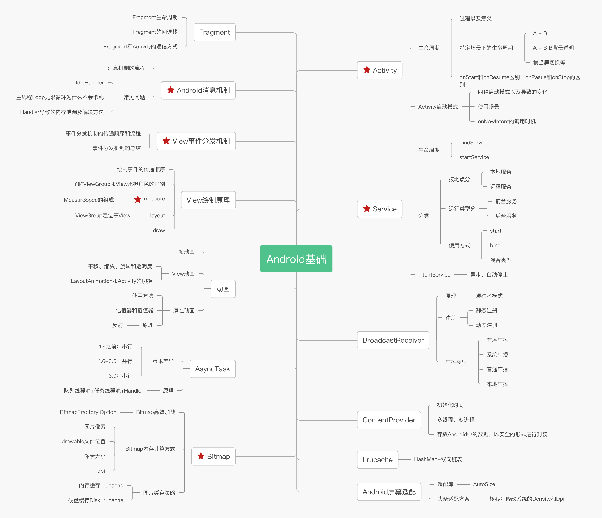
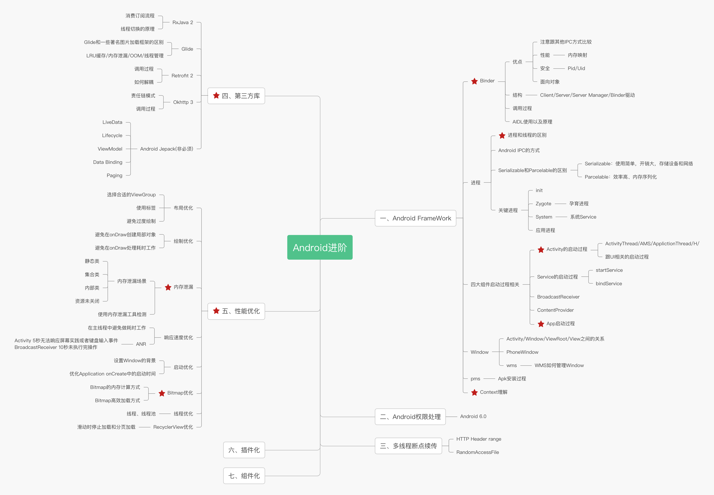
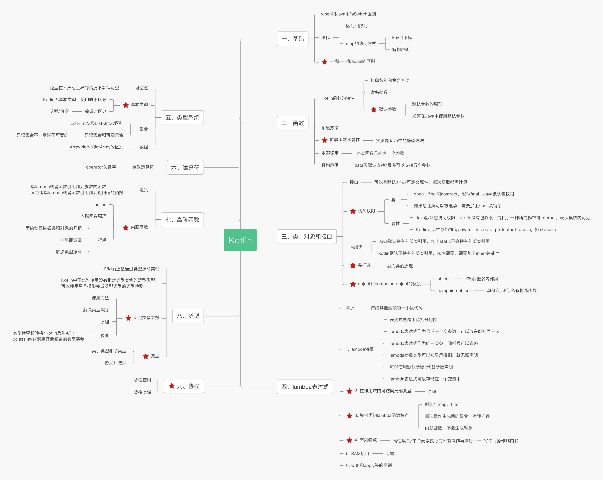
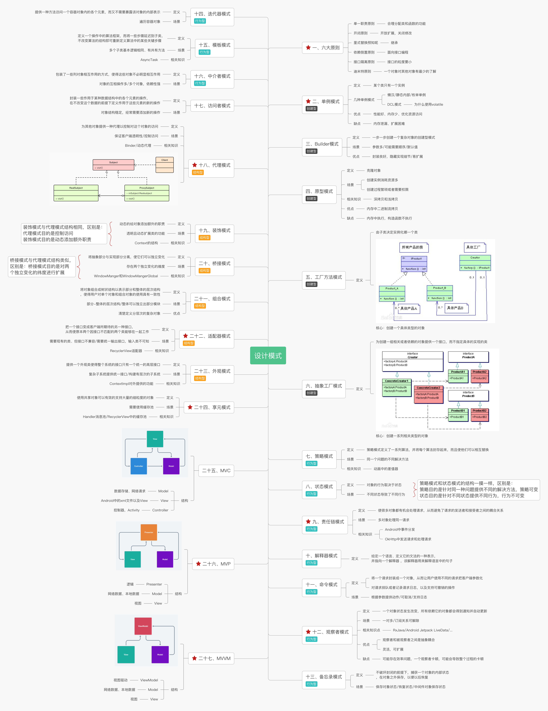

Android demo

## Android 知识
 - [Android 四大组件](https://juejin.im/post/5db12d926fb9a0205e766cc2)
 - [Android 动画总结](https://blog.csdn.net/carson_ho/article/details/79860980)
 - [Android 消息机制](https://xiaozhuanlan.com/topic/9026158374)
 - [Android 性能优化](https://blog.csdn.net/carson_ho/article/details/79708444)
 - [Android 进程间通信](https://www.jianshu.com/p/96062c549b2a)
 - [Android 事件分发机制](https://blog.csdn.net/carson_ho/article/details/54136311)
 - [Fragment 生命周期](https://juejin.im/post/5c2df25be51d451d46035449)
 - [Activity 生命周期](https://blog.csdn.net/carson_ho/article/details/51173261)
 - [Activity 启动模式](https://blog.csdn.net/carson_ho/article/details/54669547)
 - [Service 详解](https://blog.csdn.net/carson_ho/article/details/53160049)
 - [ContentProvider 详解](https://blog.csdn.net/carson_ho/article/details/76101093)
 - [BroadcastReceiver 详解](https://blog.csdn.net/carson_ho/article/details/52973504)
 - [WebView 详解](https://blog.csdn.net/carson_ho/article/details/52693322)

## Android 框架
### Jetpack
 - [Jetpack](https://developer.android.com/jetpack)

### 异步
 - [Rxjava](https://github.com/ReactiveX/RxJava)
 - [RxAndroid](https://github.com/ReactiveX/RxAndroid)

### 网络请求
 - [Okhttp3](https://github.com/square/okhttp)
 - [Retrofit](https://github.com/square/retrofit)

### 网络请求封装
 - [OkGo](https://github.com/jeasonlzy/okhttp-OkGo)
 - [RxHttp](https://github.com/liujingxing/okhttp-RxHttp)
[RxHttpUtils](https://github.com/lygttpod/RxHttpUtils)

### 图片加载
 - [Glide](https://github.com/bumptech/glide)
 - [Picasso](https://github.com/square/picasso)

### 数据库
 - [Room](https://developer.android.com/training/data-storage/room)
 - [greenDAO](https://github.com/greenrobot/greenDAO)

### 事件总线
 - [EventBus](https://github.com/greenrobot/EventBus)
 - [LiveEventBus](https://github.com/JeremyLiao/LiveEventBus)

### 路由框架
 - [ARouter](https://github.com/alibaba/ARouter)
 - [WMRouter](https://github.com/meituan/WMRouter)

### 图片压缩
 - [Luban](https://github.com/Curzibn/Luban)
 - [Compressor](https://github.com/zetbaitsu/Compressor)

### 时间/选项选择器
 - [PickerView](https://github.com/Bigkoo/Android-PickerView)

### 下拉刷新
 - [SmartRefreshLayout](https://github.com/scwang90/SmartRefreshLayout)

### 进度条
 - [NumberProgressBar](https://github.com/daimajia/NumberProgressBar)

### JSON解析
 - [Gson](https://github.com/google/gson)
 - [Fastjson](https://github.com/alibaba/fastjson)

### Banner
 - [Banner](https://github.com/youth5201314/banner)
 - [BGABanner](https://github.com/bingoogolapple/BGABanner-Android)

### 沉浸式状态栏
 - [ImmersionBar](https://github.com/gyf-dev/ImmersionBar)

### RecyclerView分割线
 - [Sticky Headers](https://github.com/timehop/sticky-headers-recyclerview)
 - [FlexibleDivider](https://github.com/yqritc/RecyclerView-FlexibleDivider)
 - [RecyclerViewDivider](https://github.com/fondesa/recycler-view-divider)

### RecyclerView LayoutManager
[RecyclerView-LayoutManager](https://github.com/jiang111/Awesome-RecyclerView-LayoutManager)

### 适配器封装
 - [BaseAdapter](https://github.com/hongyangAndroid/baseAdapter)
 - [BaseAdapterHelper](https://github.com/JoanZapata/base-adapter-helper)
 - [BaseRecyclerViewAdapterHelper](https://github.com/CymChad/BaseRecyclerViewAdapterHelper)

### 开关控件
 - [SwitchButton](https://github.com/kyleduo/SwitchButton)

### 屏幕适配
 - [AndroidAutoSize](https://github.com/JessYanCoding/AndroidAutoSize)

### 圆角图片
 - [RoundedImageView](https://github.com/vinc3m1/RoundedImageView)

### 字体样式
 - [SimplifySpan](https://github.com/iwgang/SimplifySpan)

### 日志打印
 - [Logger](https://github.com/orhanobut/logger)

### 权限请求
 - [RxPermissions](https://github.com/tbruyelle/RxPermissions)
 - [EasyPermission](https://github.com/googlesamples/easypermissions)
    
## 学习
 - [Kotlin 中文网](https://www.kotlincn.net/)
 - [Android 基础入门教程](https://www.runoob.com/w3cnote/android-tutorial-intro.html)
 - [Android 完整思维导图](https://www.runoob.com/wp-content/uploads/2015/06/androidmap.pdf)
 - [测试API](https://gank.io/api)

## 开发
 - [忽略文件](./.gitignore)
 - [混淆配置](./app/proguard-rules.pro)

## 颜色
Android 中的颜色值通常遵循 `RGB/ARGB` 标准，使用时通常以 `#` 字符开头的8位16进制表示。其中`ARGB` 依次代表透明度（Alpha）、红色(Red)、绿色(Green)、蓝色(Blue)，取值范围为`0 ~ 255`（即16进制的`0x00 ~ 0xff`）。
`A` 从 `0x00` 到 `0xff` 表示从透明到不透明，`RGB` 从 `0x00` 到 `0xff` 表示颜色从浅到深。当 `RGB` 全取最小值(`0`或`0x000000`)时颜色为黑色，全取最大值(`255`或`0xffffff`)时颜色为白色。颜色透明度表如下：

> 以颜色值#FF99CC00为例，其中FF是透明度，99是红色值，CC是绿色值，00是蓝色值。
>  - 全透明：#00000000/(0,0,0,0)
>  - 半透明：#80000000/(128,0,0,0)
>  - 不透明：#FF000000/(255,0,0,0)

## 思维导图

